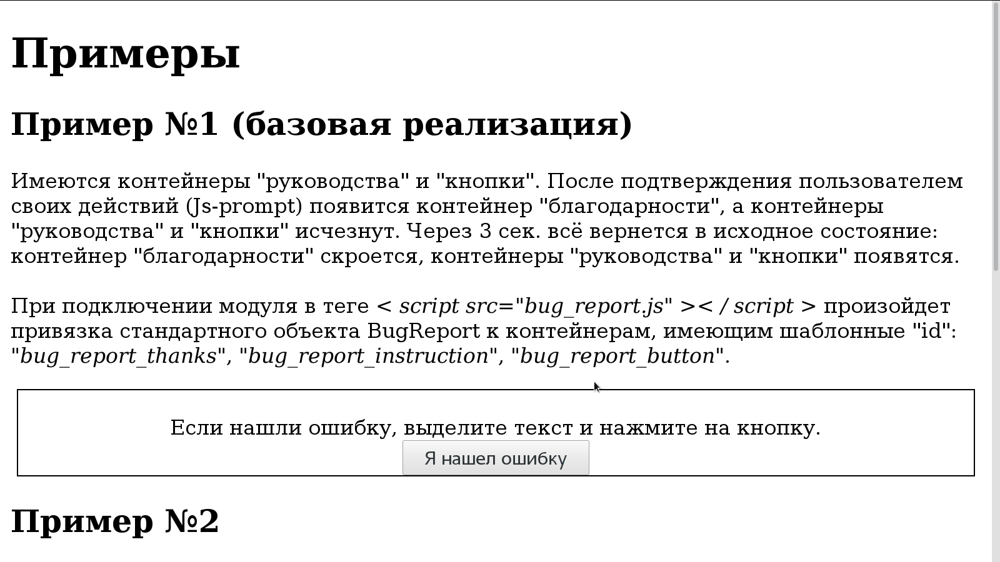
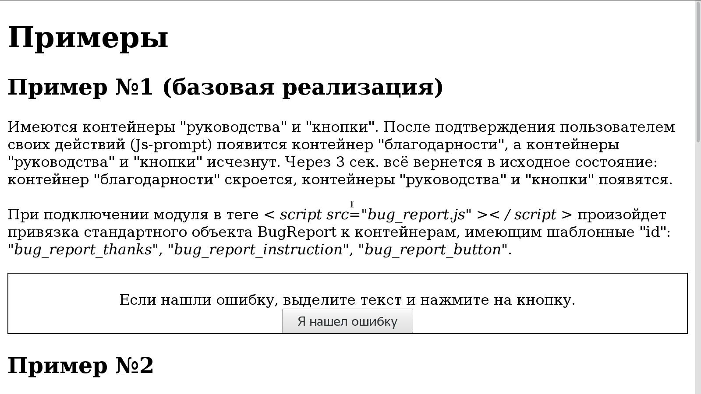

# BugReport (Webpack-сборка)

Допустим, имеется JS-пакет <a href="https://github.com/BorisPlus/BugReport" target="_blank">https://github.com/BorisPlus/BugReport</a>. Задача упаковать его в модуль с использованием Webpack.
 
 **Оффтоп**: мдя, почему не работает `<a href="..." target="_blank">...</a>` или `[link](url){:target="_blank"}`.


## Описание процесса сборки модуля с использованием Webpack

### Предварительно

В терминале (возможно Вам понадобятся права _root_, прибегните к `sudo` или `su`):

```bash
apt-get install -y nodejs #nodejs -v
cd ./project
npm install webpack
npm install webpack-cli
```

### Переработка (портирование) проекта

Можно ничего не делать и запустить сборку исходного _bug_report.js_:
```html
module.exports = {
    entry: './src/bug_report',
    output: {
        path: path.resolve(__dirname, 'dist'),
        filename: 'bug_report.bundle.js'
    },
    mode: 'production',
};
```

Понятно, что все заработает для <a href="https://github.com/BorisPlus/BugReport#базовый-вариант" target="_blank">базового варианта</a>.

Но если необходимо привязать объект BugReport к дополнительной "форме", то:
* либо дописать соответствующи код в конец _bug_report.js_
    ```
    let example_bug_report = new BugReport(
        'example',
        'Патлумачце дадаткова і пакажыце кантактныя дадзеныя, калі хочаце.'
    );
    let my_bug_report = new BugReport(
        'my',
        'Leave a comment and contact to contact you if you want.'
    );
    ```
  и запустить выше указанную пересборку.
  
* либо исходный код (портировать) немного переработать.

Почему нужно переработать. Логично держать "ядро" библиотеки отдельно от места его использования\вызова. Нужно, значит, создать отдельный файл `my.bug_report.js` с указанными в прошлом пункте объявлениями объектов. А чтоб этот файл "увидел" файл "ядра", необходимо применить import и export.

Перво наперво что нужно сделать, так это объявить, что класс BugReport должен экспортироваться. Добавим прямо в конец `bug_report.js`:

```html
export {BugReport};
```

Теперь в `my.bug_report.js` импортируем:

```html
import { BugReport } from './bug_report';
```

Это все.

### Сборка проекта

При отладке мне нравится использовать режим отслеживания изменений и задержку на пересборку.

Для этого есть `--watch` ключ:

```bash
npx webpack --config webpack.config.js --watch
```

или если в `webpack.config.json`:

```
module.exports = {
    ...
    watch: true,
    watchOptions: {
        aggregateTimeout: 300
    }
    ...
};
```

Запуск сборки

```bash
cd project/
npm run build
```
<khb>
в случае пересбоки

```bash
cd project/
npm run build:dev
```

или

```bash
cd project/
npx webpack --config webpack.config.js --watch
```
</khb>

### Проверка работоспособности

Откройте проектный пример <a href="https://github.com/BorisPlus/otus_webpython_018/blob/master/project/examples/examples.html" target="_blank">examples.html</a>.

Поведение идентично изначальному, см. GIF-анимацию:

<kbd></kbd>

## Coderfriendly-подход

Если в конфиг `webpack.config.json` в позицию `output` добавить:

```html
module.exports = {
    ...
    output: {
        ...
        libraryTarget: 'var',
        library: 'PackedBugReport'
        ...
    },
    mode: 'production',
};
```

то сторонним разработчикам совсем не обязательно пересобирать проект и "зашивать" (как это было сделано с `my.bug_report.js`) свою реализацию в собираемый "модуль". 

Достаточно сделать в `my.bug_report.js` проброс экспорта:

```html
export { BugReport };
```

и стороннему разработчику станет возможным делать привязку к своим объектам _BugReport_ (подгружая класс _**PackedBugReport**.BugReport_ внутри HTML кода или же в отдельном своем файле):

```html
let module_usage_bug_report = new PackedBugReport.BugReport('module_usage');
```

Это продемонстрировано в "Примере №4" файла <a href="https://github.com/BorisPlus/otus_webpython_018/project/examples/examples.html" target="_blank">примеров</a>, где первые три примера подгружаются из webpack-сборки, а последний - с использованием стороннего (с точки зрения данной webpack-сборки) файла `module_usage.bug_report.js`.

GIF-анимация "Примера №4":
<kbd></kbd>

## Вывод

Модульная инкапсуляция и разрешение на импорт только дозволенного - это конечно плюс, но требует опыта, и по отладке в том числе.

## Факультатив

```bash
npm install webpack-dev-server
```

Добавить в `package.json`
```json
    "scripts": {
        ...
        "start:dev": "webpack-dev-server",
        ...
      }
    ...
```

Запускать как

```bash
npm run start:dev
```

лог для примера

```
ℹ ｢wds｣: Project is running at http://localhost:8080/
ℹ ｢wds｣: webpack output is served from /
ℹ ｢wdm｣: Hash: 824dff377fed0766975b
Version: webpack 4.23.1
Time: 798ms
Built at: 2018-10-27 00:10:37
               Asset     Size  Chunks             Chunk Names
bug_report.bundle.js  143 KiB       0  [emitted]  main
Entrypoint main = bug_report.bundle.js
 [2] multi (webpack)-dev-server/client?http://localhost:8080 ./src/my.bug_report 40 bytes {0} [built]
 [3] (webpack)-dev-server/client?http://localhost:8080 7.78 KiB {0} [built]
 [4] ./node_modules/url/url.js 22.8 KiB {0} [built]
 [5] ./node_modules/node-libs-browser/node_modules/punycode/punycode.js 14.3 KiB {0} [built]
 [7] ./node_modules/url/util.js 314 bytes {0} [built]
 [8] ./node_modules/querystring-es3/index.js 127 bytes {0} [built]
[11] ./node_modules/strip-ansi/index.js 161 bytes {0} [built]
[12] ./node_modules/ansi-regex/index.js 135 bytes {0} [built]
[13] ./node_modules/loglevel/lib/loglevel.js 7.68 KiB {0} [built]
[14] (webpack)-dev-server/client/socket.js 1.05 KiB {0} [built]
[15] ./node_modules/sockjs-client/dist/sockjs.js 180 KiB {0} [built]
[16] (webpack)-dev-server/client/overlay.js 3.58 KiB {0} [built]
[21] (webpack)/hot sync nonrecursive ^\.\/log$ 170 bytes {0} [built]
[23] (webpack)/hot/emitter.js 75 bytes {0} [built]
[25] ./src/my.bug_report.js + 1 modules 3.6 KiB {0} [built]
     | ./src/my.bug_report.js 416 bytes [built]
     | ./src/bug_report.js 3.2 KiB [built]
    + 11 hidden modules
ℹ ｢wdm｣: Compiled successfully.
```

## Авторы

* **BorisPlus** - [https://github.com/BorisPlus/otus_webpython_018](https://github.com/BorisPlus/otus_webpython_018)

## Лицензия

Свободно

## Дополнительные сведения

Проект в рамках домашнего задания курса "Web-разработчик на Python" на https://otus.ru/learning
