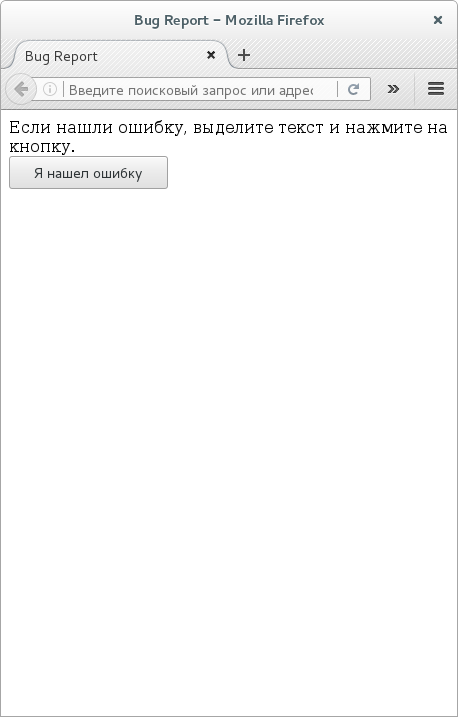
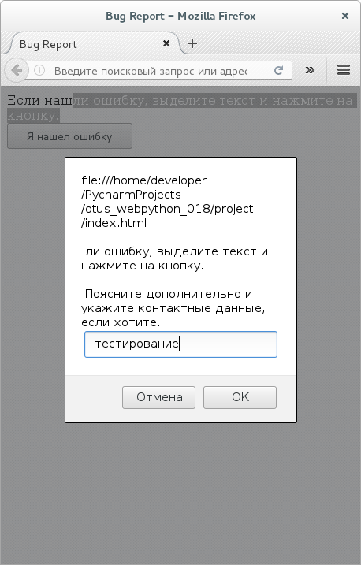
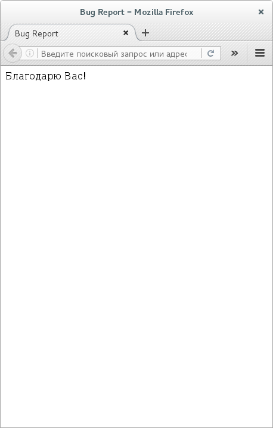

# BugReport 

BugReport - JS-пакет, чей функционал дает возможность отсылать уведомления пользователями сайта его администрации о наличии ошибки в тексте на сайте.

Описание содержит пример сборки JS-пакета с использованием Webpack.

## Описание сборки

### Предварительно

В терминале (возможно Вам понадобятся права _root_, прибегните к `sudo` или `su`):

```bash
apt-get install -y nodejs
nodejs -v
npm install --global webpack
npm install --global webpack-cli
```

### Сборка проекта

```bash
cd project/
npm run build
```

Обратите внимание в `webpack.config.json` на включенный режим отслеживания изменений и задержку на пересборку.

```
module.exports = {
    ...
    watch: true,
    watchOptions: {
        aggregateTimeout: 300
    }
    ...
};
```

### Проверка работоспособности

Откройте проектный index.html в браузере





Через 3 секунды форма BugReport появится снова, а благодаственное сообщение пропадет.

## Как использовать собранныи или готовым у себя

Подключите модуль крайним в списке.

```html
<script src="./bug_report.bundle.js"></script>
```

В вашем HTML-файле создайте соотсветствующие контейнеры (Расстановка контейнеров и их CSS за вами).

Можно [так](https://github.com/BorisPlus/otus_webpython_018/blob/master/project/index.html):

```html
<div id="bug_report_thanks" style="visibility:hidden;">Благодарю Вас!</div>
<div id="bug_report_form">
    Если нашли ошибку, выделите текст и нажмите на кнопку.
    <button id="bug_report_button">Я нашел ошибку</button>
</div>
```

А можно и [так](https://github.com/BorisPlus/otus_webpython_018/blob/master/project/example_2.html):

```html
<!-- HEAD --> 
...
<script>
    var bugReportAdditionalMessage = 'Патлумачце дадаткова і пакажыце кантактныя дадзеныя, калі хочаце.';
</script>
<script src="./bug_report.bundle.js"></script>
...
<!-- BODY --> 
...
<div id="bug_report_thanks" style="visibility:hidden;">Дзякуй Вам!</div>
Калі знайшлі памылку, вылучыце тэкст і націсніце на кнопку.
<button id="bug_report_button">Я знайшоў памылку</button>
...
```

Во втором случае отсутствует контейнер формы `bug_report_form` (текст и кнопка), и поэтому он при отправке данных скрыт не будет.
Здесь так же продемонстрирована возможность замены PROMT-сообщения.

**Вопрос**: а как у подгруженного класса переопределить значение свойства? Как-то [так](https://github.com/BorisPlus/otus_webpython_018/blob/master/project/example_3.html) у меня не вышло...

```html
    <script src="./bug_report.bundle.js"></script>
    <script>
        BugReport.additionalMessage = 'Give me additional description.';
    </script>
```

## Авторы

* **BorisPlus** - [https://github.com/BorisPlus/otus_webpython_018](https://github.com/BorisPlus/otus_webpython_018)

## Лицензия

Свободно

## Дополнительные сведения

Проект в рамках домашнего задания курса "Web-разработчик на Python" на https://otus.ru/learning
